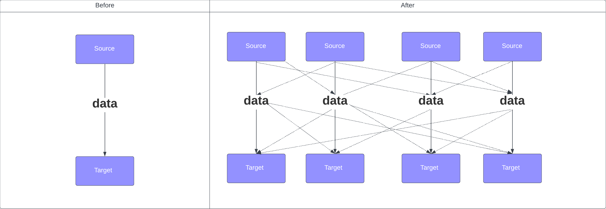
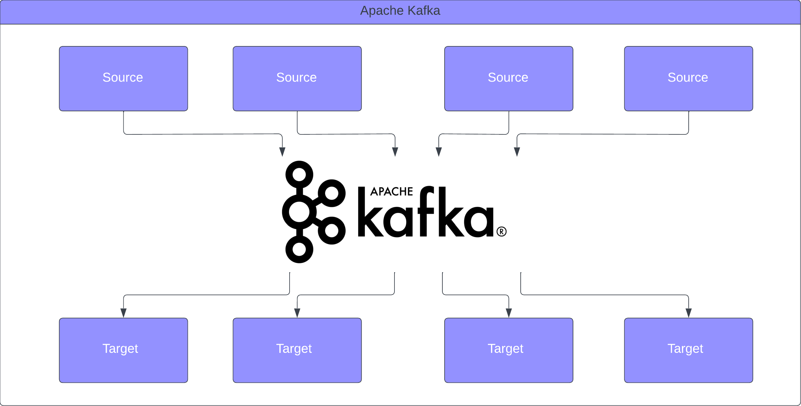
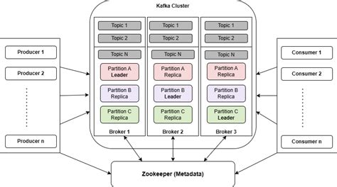

# Introduction

## Integration story

### How integration becomes complicated
- Companies start with simple integrations.
- Complexity increases, number of integrations increase.
  - multiple protocols (TCP,HTTP,SFTP)
  - changes in data format (Binary, csv, JSON, Avro, Protobuf)
  - Schema evolution (adding new fields to json/POJO)
  - Increase load for per connection on both source and target

### Decoupling using Kafka
- kafka sits in between source and target system
- source only responsible to produce
- target only responsible to consume
- exactly one protocol to follow

### some advantages
- Distributed: Kafka in itself is dumb. All logic implemented at Producer and Consumer.
- Horizontal scalability: add more VMs for high traffic
  - Scale to 100s of brokers
  - Scale to millions of messages
- Delivery guarantee
  - At least once : Configurable
  - At most once : Configurable
  - Exactly once : In some cases

### use cases
- Messaging: Pub/Sub, Broadcast
- Activity tracing
- Decoupling systems
- Microservices
- Integration with other source/targets
  - Sending logs to elasticsearch.
  - Data replication between different databases.
- Streaming: Real-time left-join, right-join between 2 topics

## Kafka components high level
- Brokers(Nodes): VMs with kafka installed. Possible to add more nodes. Minimum 3
  - Topics
  - Partitions
  - Replicas
- Zookeeper: Contains metadata
- Cluster = (Broker + Zookeeper + Access Policies)
- Producers/Consumers: Microservices communicating with Kafka

