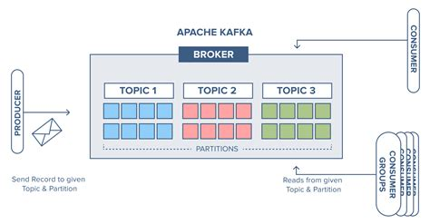
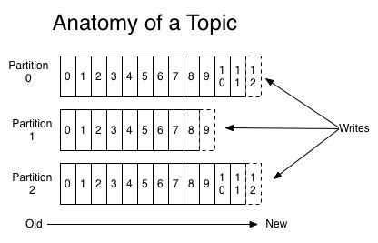

# Kafka concepts

## Topic, partitions and offsets

### Topics

Topics are similar to database tables (only real time)
- Represents an entity (or an event or additional info)
- Exceptions
  - Can hold complicated data structures
  - Topics are immutable
  - Topics can not be queried. You can either read from start, or read from end
  - Topics have retention period (configurable)

- Represents a data stream for example. Order, Payment, Invoice etc
- Identified by a name eg: WB_OUT_ORDER, WB_IN_PAYMENT
- Any kind of message format.
  - Message is stored in binary format
  - Be careful with drastically changing data format for a topic. This can break consumer.
- Each topic has partitions (for redundancy)
- Producer writes, Consumer reads.

### Partitions and offsets
- Topics are split into partitions (eg 3 partitions).
  - Messages within a partition are **guaranteed to be ordered**.
  - The id of the message is called **offset**.
  - Messages send to a topic may not be in order.

- Topics are immutable: once data written, it can **never** be changed.
- Retention period: Data in a topic is only kept for a limited time. Configurable
- Offset are only valid for a partition, not topic(across partitions).
- Offsets always increment. Cannot reuse even if previous messages are deleted.
- Data is assigned randomly to a partition.(?????)
- Can have as many partitions as we need (10, 100, 1000)