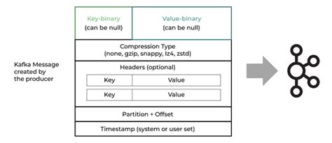
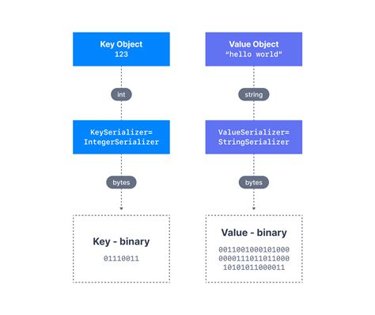
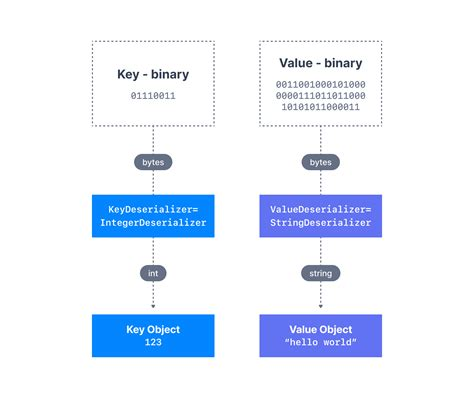

# Kafka message
[Home](../../README.md)

## Anatomy of a kafka message

### Components of a message
- **Message Key**: can be null
- **Message Value** : cab be null
- **Compression type**
- **Headers**: Optional
- **Partition and Offset**
- **Timestamp** : system or user provided

A message inside kafka is always stored as bytes. The means before sending a message to Kafka, the programming language should serialize the Key and Value to bytes.

## Producers (publisher/sender)
Producer knows before sending the message that which partition should be used.
- **Serialization**
  - If key != null: then serialize key as bytes.
  - If value != null: then serialize value as bytes.
- **Identify partition**: Figure out which partition the message should land on. (Key hashing)
- **Push**: Producer pushes the data to Kafka.

### Ordering messages
- **No Message key**: Producer well send data to partitions in round-robin fashion.
- **Consistent Message key**: for example order-id, The messages for that order will land on same partition. All records for that order will always be in order.

## Consumer (subscriber/receiver)
- **Pull**: Consumers pull messages from Kafka. Can be done in batches (100 messages per pull)
- **Ordering**: Within a partition, messages are read in order (from offset 0,1,2.....)
  - If producer sends a consistent key. Message always land on same partition, hence consumer always reads in order.
- **Deserialization**: Reverse of Producer
  - Consumer should know exactly, how to deserialize.
  - The contract (POJO) should stay consistent between Producer/Consumer.
- **Acknowledgement**: After consuming message, Consumer sends an ack message to commit offset.
- Next pull, 100 more messages are pulled from previous commit offset.

## Some FAQs
- What if Kafka is not available
  - Multiple nodes ( Minimum 3)
  - Replication factor
- What if broker crashes
  - Replication factor + partition count
  - Spread across several brokers

- What if some of the brokers are not available (network)
  - Producer/Consumers are smart. If any of the broker is available, then message will go through.
  
Same Object representation should be available at Producer/Consumer.
- What if using across different programming languages??
  - Use a standard serde technologies 
    - Protobuf
    - Json Schema
    - **Avro**: Has great compatibility within Kafka ecosystem.
  - Process:
    - Save the avro files in a different package (library)
    - Import the jar/artifact.
    - Use maven plugin to generate JAVA classes.
- What if the message structure changes??
  - Change in field name, class name.
  - Adding removing fields.
  - **Option1**: Create a new topic, produce/consume from the new topic
  - **Schema Registry**: TBD

[Home](../../README.md)
