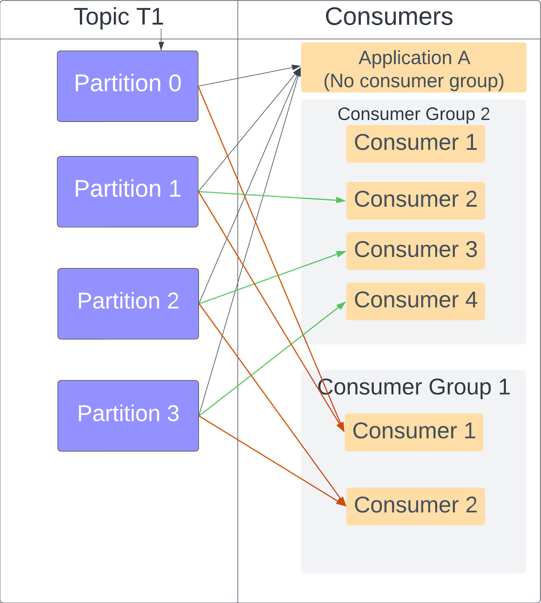

# Consumer and consumer groups
[Home](../../README.md)

## Standalone consumer

Topic T1
- Partition 0
- Partition 1
- Partition 2
- Partition 3

### Consumer (Single application)
- Same application needs to read from all the partitions.
- Performance bottleneck in case of high throughput requirements.

### Consumer Group (multiple instances of same application)
- Provide a group.id="Consumer Group 1"
- Each instance (replica) of consumer application connects to different set of partitions.
- This means, load is shared between 4 instances.
#### Additional advantages
- Better throughput.
- When one of the consumer dies and comes back again(redeployment). ConsumerGroup knows which partition to assign to this consumer in the CG.
- Each consumer group can have its own view for same data stream
    - For example fleet of trucks sending info to kafka every 20 sec
        - Consumer Group A -> Track GPS location
        - Consumer Group B -> Track Delivery to closest customer
        - Consumer Group C -> Track

[Home](../../README.md)
